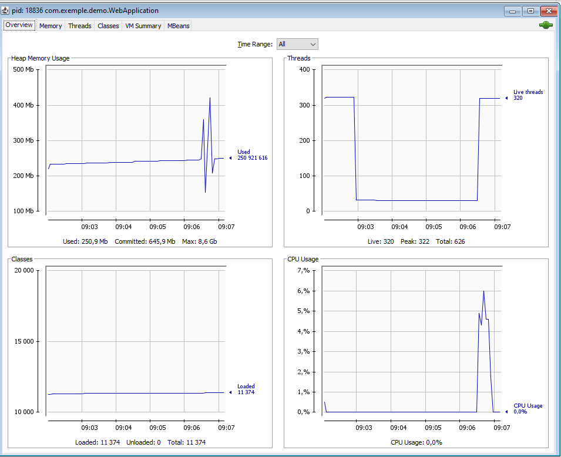
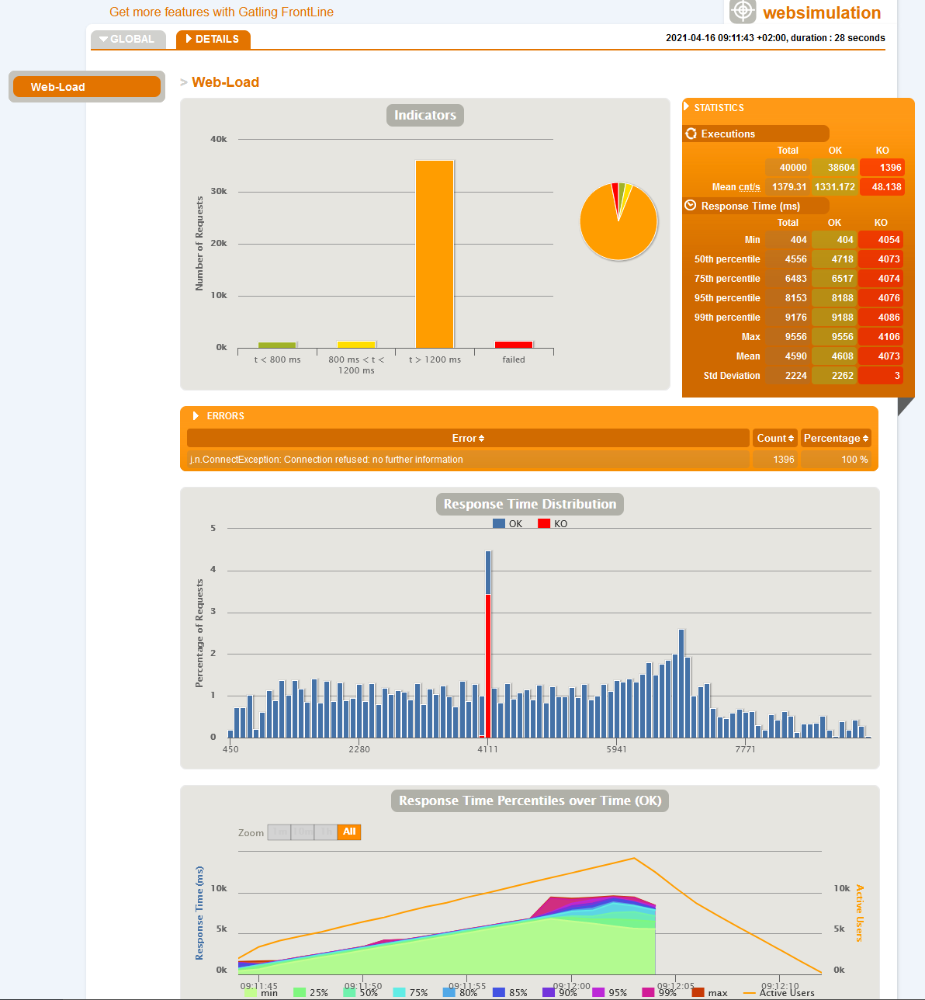
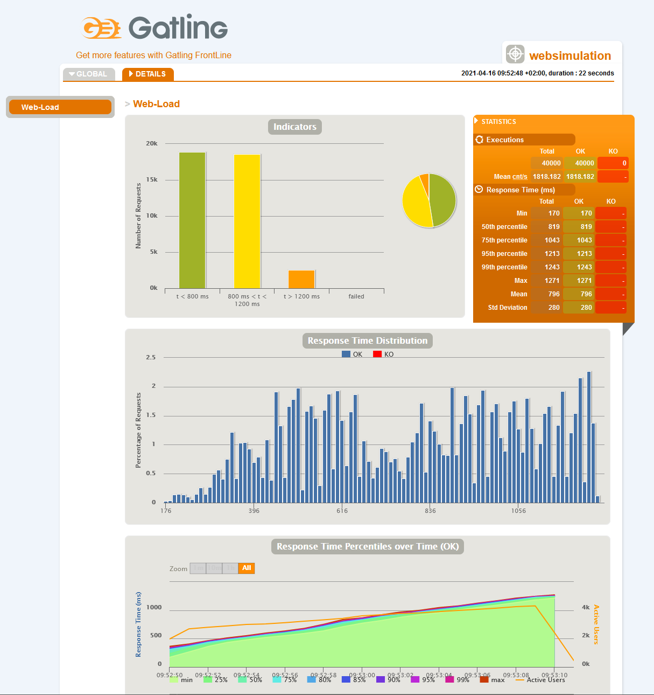
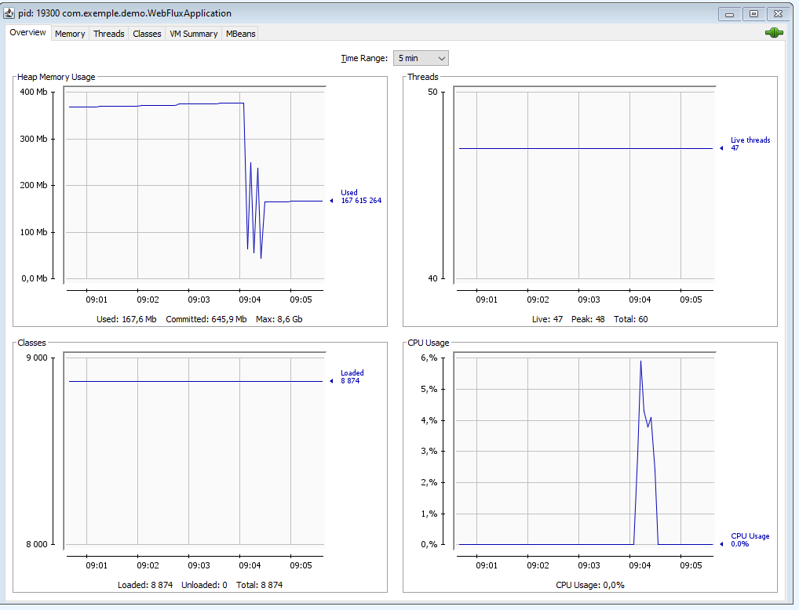

# TOMCAT spring web req avec temps de 100ms

    server.tomcat.max-connections=8182
    server.tomcat.threads.max=200

    server.tomcat.max-connections=8182
    server.tomcat.threads.max=300

    server.tomcat.max-connections=16192
    server.tomcat.threads.max=300

# TOMCAT spring web req avec temps de 200ms
    server.tomcat.max-connections=16192
    server.tomcat.threads.max=300

# TOMCAT spring web req avec temps de 150ms + appel BD
    server.tomcat.max-connections=16192
    server.tomcat.threads.max=300

# NETTY spring webflux req avec temps de 100ms

# NETTY spring webflux req avec temps de 200ms

# NETTY spring webflux req avec temps de 150ms + appel BD

